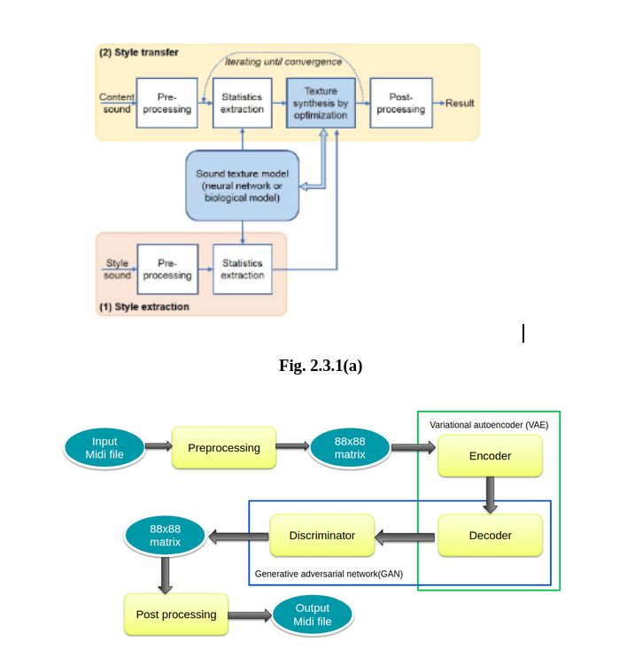

# MusicStyleTransfer

Represent one style of music to another!

# Introduction

Observing the success of neural nets in other fields we aim to produce interesting results from music . Music is fundamentally a sequence of notes. A composer
constructs long sequences of notes which are then performed through an instrument to produce music. Humans can easily identify the genre of a music by just
listening to it .However it is quite difficult to parametrize the style of music as it is not dependent on any fixed metric such as pitch,vocal etc but depends on its composition and performance which need to be correlated. Although the genre of music (Classical , Jazz etc  )depends on the listener, there are certain distinguishing characteristics of each genre. Generative models can be applied to change properties of existing data in a principled way, even transfer properties between data samples.In this report we will aim to understand the styles of the different music genres and transform one style of music to another through transfer of properties. We show a comparison between various approaches and the resulting musical pieces by means of Generative Adversarial networks (GANs) and Sequence - Sequence Model(Seq-Seq).

# Methadology

1) Spectrogram Analysis :In the proposed spectrogram analysis method two audio files are taken as an input. This method follows three phases:The audio files are converted to their respective spectrogram images , The spectrogram images are analyzed by feature extraction and merged . The result spectrogram image is reconstructed toan audio file.

2) VAE-GAN :We propose a VAE-GAN architecture(Variational Auto-encoder Generative Adversarial Network). By combining a variational auto-encoder with a generative
adversarial network , the learned feature representations in the GAN discriminator can be used as the basis for the VAE reconstruction objective. This makes the training process significantly more stable as opposed to using just a VAE as the generator has information regarding the real-world entities it is trying to generate from the discriminator of the GAN rather than guessing what the real-world entity should be at each iteration. In addition, the Encoder learns the mapping of images to Latent space which is very useful.

# Architecture Diagram

# Results

